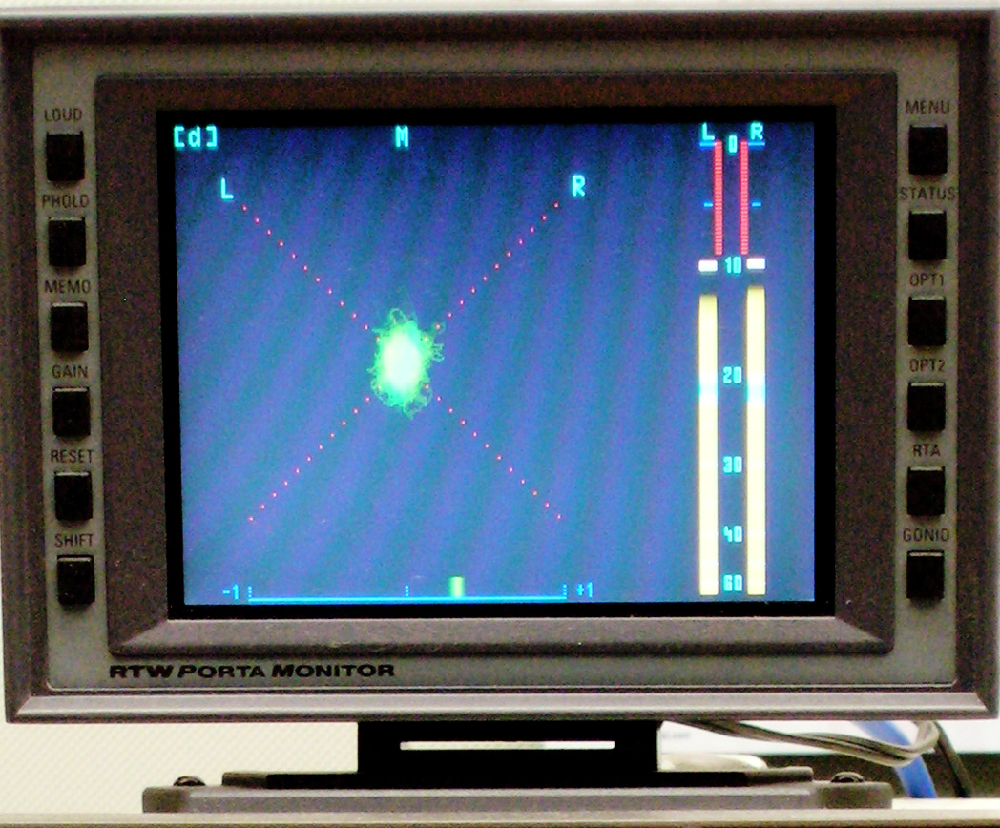

# JS GonioMeter / VectorScope / CorrelationMeter / PhaseMeter

## Idea
Wanted to make a visualisation for stereo audio signals.

I started this because i remembered the old Amiga DeliTracker visualisation which is nowadays used in ReNoise.

### Terminus
Start with a picture to reference the single elements

I found a lot of names for the display i'm talking about (picture mid):
- Goniometer
- Vector scope
- Audio vector oscilloscope
- Jellyfish display (new name for surround signals)

These display type is often combined with:
- CorrelationMeter/PhaseMeter (picture bottom)
- LevelMeter/VU/PPM meter (picture right)

### Road map
I will start with plain goniometer, because there are already several other vu/spectrum/wavescopes out there.

## Features/ToDo
### Features
- GonioMeter
- draw background L/R line
- draw background circles
- fully configurable (background, colors, ...)
### ToDo
- CorrelationMeter
- VU/PPM with different scales
- Surround
- Peak hold
- Scale signal

## How it's calced:
- https://www.kvraudio.com/forum/viewtopic.php?t=477945
- https://dsp.stackexchange.com/questions/1671/calculate-phase-angle-between-two-signals-i-e-digital-phase-meter

## How to implement
"index.html" shows how to connect to Juergen Wothkes scriptprocessor player.

"audiotag.html"shows how to connect to an HTML audio tag.

## Wiki:
A goniometer is often included in analog audio equipment to display a Lissajous figure which shows the amount of stereo (that is, phase differences) in a dual-channel signal. It allows the sound technician to adjust for optimal stereo and determine the makeup of errors such as an inverted signal. Many goniometers also provide a VU or PPM as a secondary function. A goniometer adapted for surround metering is called a 'jellyfish display'. This term was coined by DK-Technologies A/S from Denmark.

### Function
Its function is to plot a signal on a two-dimensional area so that the correlation between the two axes (audio channels, or phases) becomes apparent.

The channels are plotted on diagonal axes; a left-channel-only signal would form a diagonal line running top-left to bottom-right and a right-channel-only signal would form the opposite diagonal running top-right to bottom-left. A signal on both channels would provide components on both axes and thus expand the plot into two dimensions: a mono signal would produce a straight line angled according to balance; whereas a stereo signal, being asymmetrical, would produce a jittery and fluffy-looking ball (see image).

An audio technician would typically begin a session by adjusting the equipment (usually with a 1 kHz mono tone) so that the output produces a vertical plot line. If one channel were phase-inverted, it would result in the plot line being a horizontal instead of vertical, a sure sign of problems. As for mono signals, a half-inverted signal would be reduced to (near) silence.

The persistence of a CRT display is a desired effect on goniometers because the signal display is very dynamic, and the overall shape or envelope of the signal is the object of interest. In fact, good digital and software goniometers provide artificial and even user-adjustable persistence.

The goniometer proves useful because it provides very dense information in an analog and surprisingly intuitive form. From the display, one can get a good feel for the audio levels for each channel, the amount of stereo and its compatibility as a mono signal, even to some degree what frequencies are contained in the signal. Experts may even be able to determine the probable arrangement of microphones when the signal was recorded.

For more information see also german wikipedia: https://de.wikipedia.org/wiki/Korrelationsgradmesser
